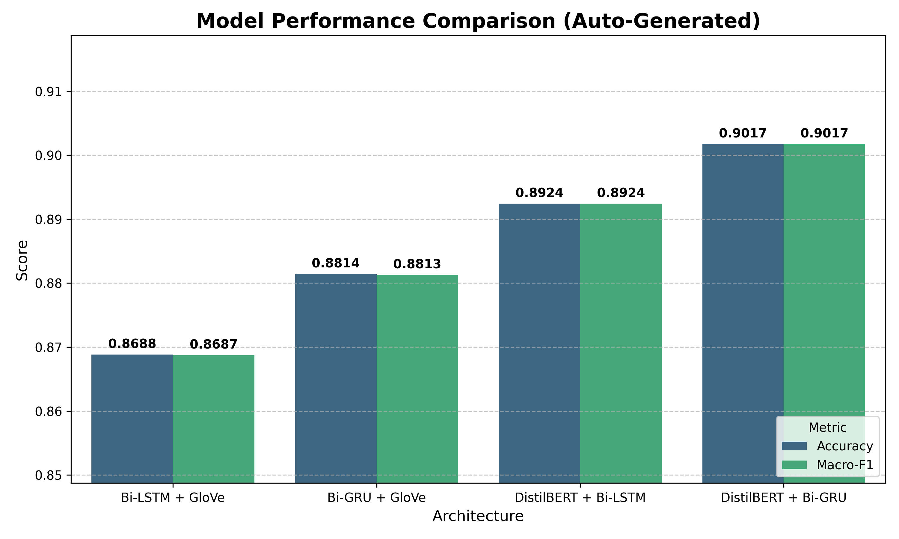
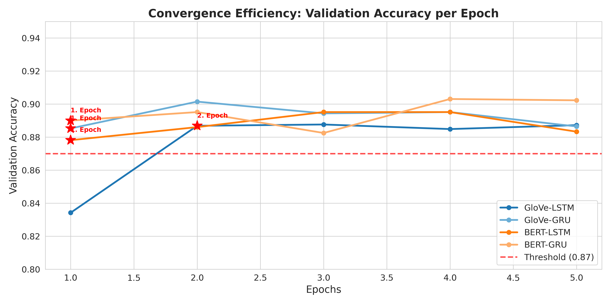
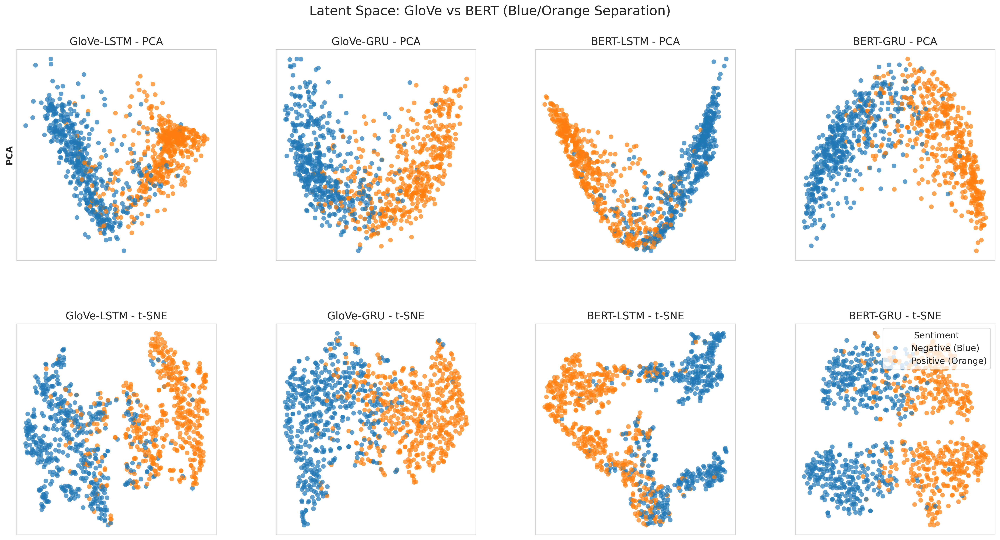

# Question 1: Sentiment Analysis on IMDb Dataset

## 📋 Overview

This project compares **static embeddings (GloVe)** vs **contextual embeddings (DistilBERT)** for binary sentiment classification using bidirectional LSTM and GRU architectures on the IMDb movie review dataset.

## 🎯 Objective

- Compare the effectiveness of static (GloVe) vs contextual (DistilBERT) word embeddings
- Evaluate LSTM vs GRU architectures for sentiment classification
- Analyze convergence efficiency and learned representations

## 📊 Dataset

| Property | Value |
|----------|-------|
| Dataset | IMDb Movie Reviews |
| Total Samples | 50,000 |
| Classes | Binary (Positive/Negative) |
| Train Set | 22,500 (90%) |
| Validation Set | 2,500 (10%) |
| Test Set | 25,000 |

## 🏗️ Model Architectures

### Models Evaluated

1. **Bi-LSTM + GloVe** - Bidirectional LSTM with GloVe 300d embeddings
2. **Bi-GRU + GloVe** - Bidirectional GRU with GloVe 300d embeddings
3. **DistilBERT + Bi-LSTM** - Frozen DistilBERT encoder with Bi-LSTM head
4. **DistilBERT + Bi-GRU** - Frozen DistilBERT encoder with Bi-GRU head

### Hyperparameters

| Parameter | Value |
|-----------|-------|
| Embedding Dimension | 300 (GloVe) / 768 (BERT) |
| Hidden Dimension | 256 |
| RNN Layers | 2 |
| Dropout | 0.5 |
| Batch Size | 32 |
| Learning Rate | 0.001 |
| Epochs | 5 |
| Optimizer | Adam |
| Loss Function | BCEWithLogitsLoss |

## 🚀 Quick Start

### 1. Install Dependencies

```bash
pip install -r requirements.txt
```

### 2. GPU Support (Optional but Recommended)

```bash
# For CUDA 11.8
pip install torch torchvision --index-url https://download.pytorch.org/whl/cu118

# For CUDA 12.1
pip install torch torchvision --index-url https://download.pytorch.org/whl/cu121
```

### 3. Run the Notebook

Open `midterm_q1.ipynb` in Jupyter Notebook or VS Code and run all cells sequentially.

```bash
jupyter notebook midterm_q1.ipynb
```

## 📁 Project Structure

```
Q1/
├── midterm_q1.ipynb          # Main experiment notebook
├── requirements.txt          # Python dependencies
├── README.md                 # This file
├── best_model_LSTM.pt        # Trained GloVe-LSTM model
├── best_model_GRU.pt         # Trained GloVe-GRU model
├── best_bert_LSTM.pt         # Trained BERT-LSTM model
├── best_bert_GRU.pt          # Trained BERT-GRU model
├── performance_comparison_auto.png    # Performance bar chart
├── convergence_efficiency.png         # Convergence graph
└── latent_space_blue_orange.png       # PCA/t-SNE visualization
```

## 📈 Results

### Test Set Performance

| Model | Accuracy | Macro-F1 | Convergence (Epoch) |
|-------|----------|----------|---------------------|
| Bi-LSTM + GloVe | 86.88% | 0.8687 | 2 |
| Bi-GRU + GloVe | 88.14% | 0.8813 | 1 |
| DistilBERT + Bi-LSTM | 89.24% | 0.8924 | 1 |
| **DistilBERT + Bi-GRU** | **90.17%** | **0.9017** | **1** |


## 📊 Visualizations

### 1. Model Performance Comparison


### 2. Convergence Efficiency


### 3. Latent Space (PCA & t-SNE)



## 🔧 System Requirements

- **Python**: 3.9, 3.10, or 3.11
- **GPU**: NVIDIA GPU with CUDA support (recommended)
- **RAM**: 8GB minimum, 16GB recommended
- **Storage**: ~2GB (GloVe vectors + dataset cache)

## 🐛 Troubleshooting

### GloVe Download Fails
GloVe embeddings (~862MB) are auto-downloaded on first run. Check internet connection. Files are cached in `.vector_cache/`.

### CUDA Out of Memory
Reduce `BATCH_SIZE` from 32 to 16 or 8.


